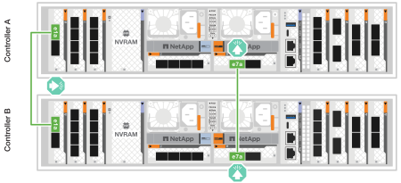
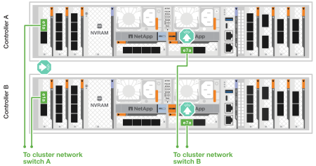
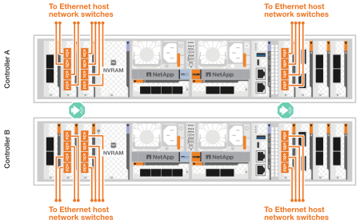
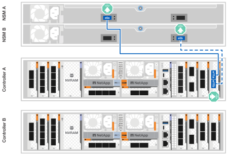
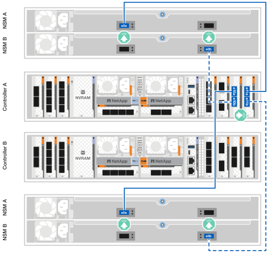

= Conecte os cabos de hardware para o sistema de storage ASA A1K
:allow-uri-read: 
:icons: font
:imagesdir: ../media/

[role="lead"]
Conecte o sistema de storage ASA A1K à sua rede e aos shelves de storage para habilitar a comunicação do cluster, acesso de gerenciamento e conectividade de host SAN. Este procedimento inclui a fiação para interconexão de cluster/HA, rede de gerenciamento, rede de host e conexões dos shelves de storage.

.Antes de começar
Contacte o administrador da rede para obter informações sobre como ligar o sistema de armazenamento aos comutadores de rede.

.Sobre esta tarefa
* Esses procedimentos mostram configurações comuns. O cabeamento específico depende dos componentes solicitados para o seu sistema de storage. Para obter detalhes abrangentes de configuração e prioridade de slot, link:https://hwu.netapp.com["NetApp Hardware Universe"^]consulte .
* Os slots de E/S no ASA A1K são numerados de 1 a 11.
+
image::../media/drw_a1K_back_slots_labeled_ieops-2162.svg[Numeração de slots em um controlador ASA A1K]

* Os gráficos de cabeamento têm ícones de seta mostrando a orientação adequada (para cima ou para baixo) da aba de puxar do conetor do cabo ao inserir um conetor em uma porta.
+
Ao inserir o conetor, você deve sentir que ele clique no lugar; se você não sentir que ele clique, remova-o, vire-o e tente novamente.

+
image:../media/drw_cable_pull_tab_direction_ieops-1699.svg["Direção da patilha de puxar do cabo"]

* Se o cabeamento de um switch ótico for feito, insira o transcetor ótico na porta da controladora antes de fazer o cabeamento da porta do switch.

== Etapa 1: Faça o cabeamento das conexões cluster/HA

Conecte os controladores por meio de cabos para criar as conexões do cluster ONTAP. Para clusters sem switch, conecte os controladores entre si. Para clusters com switch, conecte os controladores aos switches de rede do cluster.

NOTE: O tráfego de interconexão de cluster e o tráfego de HA compartilham as mesmas portas físicas.

[role="tabbed-block"]
====
.Cabeamento de cluster sem switch
--
Utilize esta opção de cabeamento quando os dois controladores estiverem conectados diretamente um ao outro, sem o uso de switches de rede em cluster.

Use o cabo de interconexão cluster/HA para conetar as portas e1a a e1a e as portas e7a a e7a.

.Passos
. Conete a porta e1a no controlador A à porta e1a no controlador B.
. Conecte a porta e7a do Controlador A à porta e7a do Controlador B.
+
*Cabos de interconexão de cluster/HA*

+
image::../media/oie_cable_25Gb_Ethernet_SFP28_IEOPS-1069.svg[Cabo de HA de cluster]

+

--
.Cabeamento de cluster comutado
--
Utilize esta opção de cabeamento quando os controladores se conectarem a switches de rede do cluster em vez de estarem conectados diretamente uns aos outros.

Utilize o cabo 100 GbE para conectar as portas e1a e e7a aos switches de rede do cluster.

NOTE: Configurações de cluster comutado são suportadas no ONTAP 9.16.1 e versões posteriores.

.Passos
. Conete a porta e1a no controlador A e a porta e1a no controlador B ao switch de rede do cluster A..
. Conete a porta e7a no controlador A e a porta e7a no controlador B ao switch de rede do cluster B.
+
*Cabo de 100 GbE*

+
image::../media/oie_cable100_gbe_qsfp28.png[Cabo 100 GbE]

+

--
====

== Etapa 2: Faça o cabeamento das conexões de rede do host

Conete as portas do módulo Ethernet à rede host.

A seguir, apresentamos alguns exemplos típicos de cabeamento de rede para hosts. Consulte link:https://hwu.netapp.com["NetApp Hardware Universe"^] para a configuração específica do seu sistema.

[role="tabbed-block"]
====
.Rede de host 100 GbE
--
Conecte as portas e9a e e9b ao seu switch de rede Ethernet de 100 GbE.

NOTE: Para obter o máximo desempenho do sistema para tráfego de cluster e interconexão HA, não utilize as portas e1b e e7b para conexões de rede do host. Utilize uma placa de host separada para maximizar o desempenho.

.Passos
. Conecte a porta e9a do controlador A e a porta e9a do controlador B ao switch de rede Ethernet.
. Conecte a porta e9b do controlador A e a porta e9b do controlador B ao switch de rede Ethernet.
+
*Cabo de 100 GbE*

+
image::../media/oie_cable_sfp_gbe_copper.svg[Cabo Ethernet 100 GbE]

+
image::../media/drw_a1k_network_cabling1_ieops-1649.svg[Cabo para rede Ethernet de 100 GbE]

--
.Rede de host 10/25 GbE
--
Conecte as portas do módulo de E/S 10/25 GbE em cada controlador aos switches de rede do host.

*Cabo 10/25 GbE*

image::../media/oie_cable_sfp_gbe_copper.svg[Cabo Ethernet 10/25 GbE]

--
====

== Passo 3: Faça o cabeamento das conexões de rede de gerenciamento

Conete os controladores à sua rede de gerenciamento.

Use os cabos RJ-45 de 1000BASEBASE-T para conetar as portas de gerenciamento (chave inglesa) em cada controlador aos switches de rede de gerenciamento.

.Passos
. Conecte a porta de gerenciamento (chave inglesa) no controlador A ao switch de rede de gerenciamento.
. Conecte a porta de gerenciamento (chave inglesa) no controlador B ao switch de rede de gerenciamento.
+
*CABOS RJ-45 DE 1000BASEBASE-T*

+
image::../media/oie_cable_rj45.svg[Cabos RJ-45]

+
image::../media/drw_a1k_management_connection_ieops-1651.svg[Conete-se à sua rede de gerenciamento]

IMPORTANT: Não conete os cabos de energia ainda.

== Etapa 4: Faça o cabeamento das conexões da prateleira

Os sistemas de storage ASA A1K suportam gabinetes NS224 com o módulo NSM100 ou NSM100B. As principais diferenças entre os módulos são:

* Os módulos de prateleira NSM100 usam portas integradas e0a e e0b.
* Os módulos de prateleira NSM100B usam as portas e1a e e1b no slot 1.

Os exemplos de cabeamento a seguir mostram módulos NSM100 nos shelves NS224 ao se referir às portas dos módulos dos shelves.

Para obter o número máximo de gavetas compatíveis com o seu sistema de storage e para todas as opções de cabeamento, como ótico e conectado a switch, link:https://hwu.netapp.com["NetApp Hardware Universe"^]consulte .

[role="tabbed-block"]
====
.Uma prateleira de storage NS224
--
Utilize esta opção de cabeamento quando tiver uma única shelf NS224.

Conete cada controlador aos módulos NSM no compartimento NS224. Os gráficos mostram o cabeamento de cada uma das controladoras: O cabeamento da controladora A é exibido em azul e o cabeamento da controladora B é exibido em amarelo.

.Passos
. No controlador A, ligue as seguintes portas:
+
.. Conete a porta e11a à porta NSM A e0a.
.. Conecte a porta e11b à porta e0b do NSM B.
+

. No controlador B, ligue as seguintes portas:
+
.. Conete a porta e11a à porta NSM B e0a.
.. Conete a porta e11b à porta NSM A e0b.
+
image:../media/drw_a1k_1shelf_cabling_b_ieops-1704.svg["Conecte as portas e11a e e11b do controlador B a uma única prateleira NS224"]

--
.Duas prateleiras de storage NS224
--
Utilize esta opção de cabeamento quando tiver duas shelves NS224.

Conecte cada controladora aos módulos do NSM nas duas gavetas NS224. Os gráficos mostram o cabeamento de cada uma das controladoras: O cabeamento da controladora A é exibido em azul e o cabeamento da controladora B é exibido em amarelo.

.Passos
. No controlador A, ligue as seguintes portas:
+
.. Conete a porta e11a ao compartimento 1 NSM A porta e0a.
.. Conete a porta e11b à porta e0b do NSM B da gaveta 2.
.. Conete a porta e10a ao compartimento 2 NSM A porta e0a.
.. Conecte a porta e10b à porta e0b do shelf 1 NSM B.
+

. No controlador B, ligue as seguintes portas:
+
.. Conete a porta e11a à porta e0a do NSM B da gaveta 1.
.. Conete a porta e11b ao compartimento 2 NSM A porta e0b.
.. Conete a porta e10a à porta e0a do NSM B da gaveta 2.
.. Conete a porta e10b ao compartimento 1 NSM A porta e0b.
+
image:../media/drw_a1k_2shelf_cabling_b_ieops-1706.svg["Conexões controlador para compartimento para o controlador B"]

--
====
.O que se segue?
Depois de conectar os controladores de storage à rede e, em seguida, conectá-los às gavetas de storage, você link:power-on-hardware.html["Ligue o sistema de armazenamento ASA r2"].
