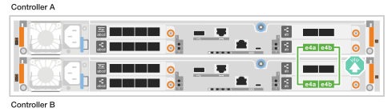
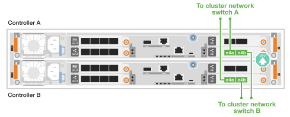
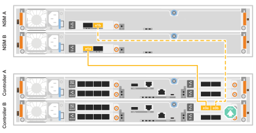

= Conecte os cabos de hardware para o sistema de storage ASA C30
:allow-uri-read: 
:icons: font
:imagesdir: ../media/

[role="lead"]
Conecte o sistema de storage ASA C30 à sua rede e aos seus shelves de storage para habilitar a comunicação do cluster, acesso de gerenciamento e conectividade de host SAN. Este procedimento inclui a fiação para interconexão de cluster/HA, rede de gerenciamento, rede de host e conexões dos shelves de storage.

.Antes de começar
Contacte o administrador da rede para obter informações sobre como ligar o sistema de armazenamento aos comutadores de rede.

.Sobre esta tarefa
* Esses procedimentos mostram configurações comuns. O cabeamento específico depende dos componentes solicitados para o seu sistema de storage. Para obter detalhes abrangentes de configuração e prioridade de slot, link:https://hwu.netapp.com["NetApp Hardware Universe"^]consulte .
* Os gráficos de cabeamento têm ícones de seta mostrando a orientação adequada (para cima ou para baixo) da aba de puxar do conetor do cabo ao inserir um conetor em uma porta.
+
Ao inserir o conetor, você deve sentir que ele clique no lugar; se você não sentir que ele clique, remova-o, vire-o e tente novamente.

+
image:../media/drw_cable_pull_tab_direction_ieops-1699.svg["Direção da patilha de puxar do cabo"]

* Se o cabeamento de um switch ótico for feito, insira o transcetor ótico na porta da controladora antes de fazer o cabeamento da porta do switch.

== Etapa 1: Faça o cabeamento das conexões cluster/HA

Conecte os controladores por meio de cabos para criar as conexões do cluster ONTAP. Para clusters sem switch, conecte os controladores entre si. Para clusters com switch, conecte os controladores aos switches de rede do cluster.

NOTE: O tráfego de interconexão de cluster e o tráfego de HA compartilham as mesmas portas físicas.

[role="tabbed-block"]
====
.Cabeamento de cluster sem switch
--
Utilize esta opção de cabeamento quando os dois controladores estiverem conectados diretamente um ao outro, sem o uso de switches de rede em cluster.

.ASA C30 com dois módulos de E/S 40/100 GbE de 2 portas
Conecte os cabos das portas de interconexão do cluster/HA nos módulos de E/S nos slots 2 e 4.

NOTE: O tráfego de interconexão de cluster e o tráfego de HA compartilham as mesmas portas físicas (nos módulos de e/S nos slots 2 e 4). As portas são de 40/100 GbE.

.Passos
. Conete a porta E2A do controlador A à porta E2A do controlador B.
. Conete a porta e4a do controlador A à porta e4a do controlador B.
+

NOTE: As portas E2B e e4b do módulo de e/S não são utilizadas e estão disponíveis para conetividade de rede de host.

+
*Cabos de interconexão de cluster/HA de 100 GbE*

+
image::../media/oie_cable100_gbe_qsfp28.png[Cabo de cluster HA de 100 GbE]

+
image::../media/drw_isi_a30-50_switchless_2p_100gbe_2card_cabling_ieops-2011.svg[Diagrama de cabeamento de cluster sem switch usando dois módulos de E/S de 100 GbE]

.ASA C30 com um módulo de e/S de 40/100 GbE de 2 portas
Conecte os cabos das portas de interconexão do cluster/HA no módulo de E/S no slot 4.

NOTE: O tráfego de interconexão de cluster e o tráfego de HA compartilham as mesmas portas físicas (no módulo de e/S no slot 4). As portas são de 40/100 GbE.

.Passos
. Conete a porta e4a do controlador A à porta e4a do controlador B.
. Conete a porta e4b do controlador A à porta e4b do controlador B.
+
*Cabos de interconexão de cluster/HA de 100 GbE*

+
image::../media/oie_cable100_gbe_qsfp28.png[Cabo de cluster HA de 100 GbE]

+

--
.Cabeamento de cluster comutado
--
Utilize esta opção de cabeamento quando os controladores se conectarem a switches de rede do cluster em vez de estarem conectados diretamente uns aos outros.

.ASA C30 com dois módulos de E/S 40/100 GbE de 2 portas
Conecte os cabos das portas de interconexão cluster/HA nos módulos de E/S nos slots 2 e 4 aos switches de rede do cluster.

NOTE: O tráfego de interconexão de cluster e o tráfego de HA compartilham as mesmas portas físicas (nos módulos de e/S nos slots 2 e 4). As portas são de 40/100 GbE.

.Passos
. Conecte a porta e4a do controlador A ao switch de rede do cluster A.
. Conecte a porta e2a do controlador A ao switch de rede do cluster B.
. Conecte a porta e4a do controlador B ao switch de rede do cluster A.
. Conecte a porta e2a do controlador B ao switch de rede do cluster B.
+

NOTE: As portas E2B e e4b do módulo de e/S não são utilizadas e estão disponíveis para conetividade de rede de host.

+
*Cabos de interconexão de cluster/HA de 40/100 GbE*

+
image::../media/oie_cable100_gbe_qsfp28.png[Cabo de cluster HA de 40/100 GbE]

+
image::../media/drw_isi_a30-50_switched_2p_100gbe_2card_cabling_ieops-2013.svg[Diagrama de cabeamento de cluster comutado usando dois módulos de E/S de 100 GbE]

.ASA C30 com um módulo de e/S de 40/100 GbE de 2 portas
Conecte os cabos das portas de interconexão cluster/HA no módulo de E/S no slot 4 aos switches de rede do cluster.

NOTE: O tráfego de interconexão de cluster e o tráfego de HA compartilham as mesmas portas físicas (no módulo de e/S no slot 4). As portas são de 40/100 GbE.

.Passos
. Conecte a porta e4a do controlador A ao switch de rede do cluster A.
. Conecte a porta e4b do controlador A ao switch de rede do cluster B.
. Conecte a porta e4a do controlador B ao switch de rede do cluster A.
. Conecte a porta e4b do controlador B ao switch de rede do cluster B.
+
*Cabos de interconexão de cluster/HA de 40/100 GbE*

+
image::../media/oie_cable100_gbe_qsfp28.png[Cabo de cluster HA de 40/100 GbE]

+

--
====

== Etapa 2: Faça o cabeamento das conexões de rede do host

Conete as portas do módulo Ethernet ou as portas do módulo Fibre Channel (FC) à rede do host.

[role="tabbed-block"]
====
.Cabeamento de host Ethernet
--
Conecte os controladores à sua rede Ethernet usando as portas apropriadas, com base na configuração do seu módulo de E/S.

.ASA C30 com dois módulos de E/S 40/100 GbE de 2 portas
Em cada controladora, as portas de cabo E2B e e4b para os switches de rede host Ethernet.

NOTE: As portas nos módulos de e/S no slot 2 e 4 são de 40/100 GbE (a conectividade de host é de 40/100 GbE).

*Cabos de 40/100 GbE*

image::../media/oie_cable_sfp_gbe_copper.png[Cabo 40/100 GbE]

image::../media/drw_isi_a30-50_host_2p_40-100gbe_2card_cabling_ieops-2014.svg[Cabo para switches de rede host Ethernet 40/100 GbE]

.ASA C30 com um módulo de e/S de 10/25 GbE de 4 portas
Em cada controlador, conecte os cabos das portas e2a, e2b, e2c e e2d aos switches de rede Ethernet do host.

*Cabos de 10/25 GbE*

image:../media/oie_cable_sfp_gbe_copper.png["Conector de cobre GbE SFP, largura=100px"]

image::../media/drw_isi_a30-50_host_2p_40-100gbe_1card_cabling_ieops-1923.svg[Cabo para switches de rede host Ethernet 10/25 GbE]

--
.Cabeamento de host FC
--
Conecte os controladores à sua rede Fibre Channel usando o módulo de E/S FC do seu sistema.

.ASA C30 com um módulo de E/S FC de 4 portas e 64 Gb/s
Em cada controlador, conecte as portas 2a, 2b, 2c e 2d aos switches de rede FC do host.

*Cabos FC de 64 GB/s*

image:../media/oie_cable_sfp_gbe_copper.png["Cabo FC de 64 Gb/s, largura=100px"]

image::../media/drw_isi_a30-50_4p_64gb_fc_1card_cabling_ieops-1924.svg[Cabo para switches de rede host FC de 64 Gb/s]

--
====

== Passo 3: Faça o cabeamento das conexões de rede de gerenciamento

Conete os controladores à sua rede de gerenciamento.

Conete as portas de gerenciamento (chave inglesa) em cada controlador aos switches de rede de gerenciamento.

*CABOS RJ-45 DE 1000BASEBASE-T*

image::../media/oie_cable_rj45.png[Cabos RJ-45]

image::../media/drw_isi_g_wrench_cabling_ieops-1928.svg[Conete-se à sua rede de gerenciamento]

IMPORTANT: Não conete os cabos de energia ainda.

== Etapa 4: Faça o cabeamento das conexões da prateleira

O procedimento de cabeamento de prateleira NS224 mostra módulos NSM100B em vez de módulos NSM100. O cabeamento é o mesmo, independentemente do tipo de módulo NSM utilizado, apenas os nomes das portas são diferentes:

* Os módulos NSM100B usam as portas e1a e e1b em um módulo de E/S no slot 1.
* Os módulos NSM100 usam portas integradas (onboard) e0a e e0b.

Para obter o número máximo de gavetas compatíveis com o seu sistema de storage e para todas as opções de cabeamento, como ótico e conectado a switch, link:https://hwu.netapp.com["NetApp Hardware Universe"^]consulte .

Conecte cada controlador a cada módulo NSM na prateleira NS224 usando os cabos de armazenamento que acompanham o seu sistema de storage.

*Cabos de cobre 100 GbE QSFP28*

image::../media/oie_cable100_gbe_qsfp28.png[Cabo de cobre de 100 GbE QSFP28]

Os gráficos mostram o cabeamento A do controlador em azul e o cabeamento B do controlador em amarelo.

.Passos
. Conete a porta e3a do controlador A à porta e1a do NSM A.
. Conete a porta e3b do controlador A à porta e1b do NSM B.
+
image:../media/drw_isi_g_1_ns224_controller_a_cabling_ieops-1945.svg["Controladora A, portas E3A e e3b cabeadas para uma gaveta de NS224 U."]

. Conete a porta e3a do controlador B à porta e1a do NSM B.
. Conete a porta e3b do controlador B à porta e1b do NSM A.
+

.O que se segue?
Depois de conectar os controladores de storage à rede e, em seguida, conectá-los às gavetas de storage, você link:power-on-hardware.html["Ligue o sistema de armazenamento ASA r2"].
