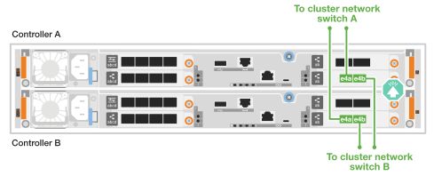
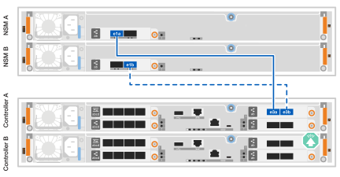

= Cable o hardware do seu sistema de storage ASA R2
:allow-uri-read: 
:icons: font
:imagesdir: ../media/

[role="lead"]
Depois de instalar o hardware de rack para seu sistema de storage ASA r2, instale os cabos de rede das controladoras e conete os cabos entre as controladoras e as gavetas de storage.

.Antes de começar
Contacte o administrador da rede para obter informações sobre como ligar o sistema de armazenamento aos comutadores de rede.

.Sobre esta tarefa
* Esses procedimentos mostram configurações comuns. O cabeamento específico depende dos componentes solicitados para o seu sistema de storage. Para obter detalhes de configuração abrangentes, link:https://hwu.netapp.com["NetApp Hardware Universe"^]consulte .
* Os gráficos de cabeamento têm ícones de seta mostrando a orientação adequada (para cima ou para baixo) da aba de puxar do conetor do cabo ao inserir um conetor em uma porta.
+
Ao inserir o conetor, você deve sentir que ele clique no lugar; se você não sentir que ele clique, remova-o, vire-o e tente novamente.

+
image:../media/drw_cable_pull_tab_direction_ieops-1699.svg["Direção da patilha de puxar do cabo"]

* Se o cabeamento de um switch ótico for feito, insira o transcetor ótico na porta da controladora antes de fazer o cabeamento da porta do switch.

== Etapa 1: Faça o cabeamento das conexões cluster/HA

Faça o cabeamento dos controladores ao cluster do ONTAP. Este procedimento difere dependendo do modelo do sistema de armazenamento e da configuração do módulo de e/S.

NOTE: O tráfego de interconexão de cluster e o tráfego de HA compartilham as mesmas portas físicas.

[role="tabbed-block"]
====
.A1K
--
Crie as conexões do cluster do ONTAP. Para clusters sem switch, conecte as controladoras umas às outras. Para clusters comutados, conete os controladores aos switches de rede do cluster.

.Cabeamento de cluster sem switch
[%collapsible]
=====
Use o cabo de interconexão cluster/HA para conetar as portas e1a a e1a e as portas e7a a e7a.

.Passos
. Conete a porta e1a no controlador A à porta e1a no controlador B.
. Conete a porta e7a no controlador A à porta e1a no controlador B.
+
*Cabos de interconexão de cluster/HA*

+
image::../media/oie_cable_25Gb_Ethernet_SFP28_IEOPS-1069.svg[Cabo de HA de cluster]

+
image::../media/drw_a1k_tnsc_cluster_cabling_ieops-1648.svg[Diagrama de cabeamento de cluster sem switch de dois nós]

=====
.Cabeamento de cluster comutado
[%collapsible]
=====
Use o cabo de 100 GbE para conetar as portas e1a a e1a e as portas e7a a e7a.

NOTE: As configurações de cluster comutado são suportadas no 9.16.1 e versões posteriores.

.Passos
. Conete a porta e1a no controlador A e a porta e1a no controlador B ao switch de rede do cluster A..
. Conete a porta e7a no controlador A e a porta e7a no controlador B ao switch de rede do cluster B.
+
*Cabo de 100 GbE*

+
image::../media/oie_cable100_gbe_qsfp28.png[Cabo de 100 GB]

+
image::../media/drw_a1k_switched_cluster_cabling_ieops-1652.svg[Conexões do cluster de cabos à rede do cluster]

=====
--
.A70 e A90
--
Crie as conexões do cluster do ONTAP. Para clusters sem switch, conecte as controladoras umas às outras. Para clusters comutados, conete os controladores aos switches de rede do cluster.

.Cabeamento de cluster sem switch
[%collapsible]
=====
Use o cabo de interconexão cluster/HA para conetar as portas e1a a e1a e as portas e7a a e7a.

.Passos
. Conete a porta e1a no controlador A à porta e1a no controlador B.
. Conete a porta e7a no controlador A à porta e1a no controlador B.
+
*Cabos de interconexão de cluster/HA*

+
image::../media/oie_cable_25Gb_Ethernet_SFP28_IEOPS-1069.svg[Cabo de HA de cluster]

+
image::../media/drw_70-90_tnsc_cluster_cabling_ieops-1653.svg[Diagrama de cabeamento de cluster sem switch de dois nós]

=====
.Cabeamento de cluster comutado
[%collapsible]
=====
Use o cabo de 100 GbE para conetar as portas e1a a e1a e as portas e7a a e7a.

NOTE: As configurações de cluster comutado são suportadas no 9.16.1 e versões posteriores.

.Passos
. Conete a porta e1a no controlador A e a porta e1a no controlador B ao switch de rede do cluster A..
. Conete a porta e7a no controlador A e a porta e7a no controlador B ao switch de rede do cluster B.
+
*Cabo de 100 GbE*

+
image::../media/oie_cable100_gbe_qsfp28.png[Cabo de 100 GB]

+
image::../media/drw_70-90_switched_cluster_cabling_ieops-1657.svg[Conexões do cluster de cabos à rede do cluster]

=====
--
.A20, A30 E A50
--
Crie as conexões do cluster do ONTAP. Para clusters sem switch, conecte as controladoras umas às outras. Para clusters comutados, conete os controladores aos switches de rede do cluster.

*Cabeamento de cluster sem switch*

Conete os controladores uns aos outros para criar as conexões do cluster do ONTAP.

.ASA A30 e ASA A50 com dois módulos de e/S de 40/100 GbE de 2 portas
[%collapsible]
=====
.Passos
. Conete as conexões de interconexão cluster/HA:
+

NOTE: O tráfego de interconexão de cluster e o tráfego de HA compartilham as mesmas portas físicas (nos módulos de e/S nos slots 2 e 4). As portas são de 40/100 GbE.

+
.. Conete a porta E2A do controlador A à porta E2A do controlador B.
.. Conete a porta e4a do controlador A à porta e4a do controlador B.
+

NOTE: As portas E2B e e4b do módulo de e/S não são utilizadas e estão disponíveis para conetividade de rede de host.

+
*Cabos de interconexão de cluster/HA de 100 GbE*

+
image::../media/oie_cable100_gbe_qsfp28.png[Cabo de cluster HA de 100 GbE]

+
image::../media/drw_isi_a30-50_switchless_2p_100gbe_2card_cabling_ieops-2011.svg[diagrama de cabeamento de cluster sem switch de a30 gbe e a50 gbe usando dois módulos de e/s de 100gbe gbe]

=====
.ASA A30 e ASA A50 com um módulo de e/S de 40/100 GbE de 2 portas
[%collapsible]
=====
.Passos
. Conete as conexões de interconexão cluster/HA:
+

NOTE: O tráfego de interconexão de cluster e o tráfego de HA compartilham as mesmas portas físicas (no módulo de e/S no slot 4). As portas são de 40/100 GbE.

+
.. Conete a porta e4a do controlador A à porta e4a do controlador B.
.. Conete a porta e4b do controlador A à porta e4b do controlador B.
+
*Cabos de interconexão de cluster/HA de 100 GbE*

+
image::../media/oie_cable100_gbe_qsfp28.png[Cabo de cluster HA de 100 GbE]

+
image::../media/drw_isi_a30-50_switchless_2p_100gbe_1card_cabling_ieops-1925.svg[diagrama de cabeamento de cluster sem switch de a30 gbe e a50 gbe usando um módulo de e/s de 100gbe gbe]

=====
.ASA A20 com um módulo de e/S de 10/25 GbE de 2 portas
[%collapsible]
=====
.Passos
. Conete as conexões de interconexão cluster/HA:
+

NOTE: O tráfego de interconexão de cluster e o tráfego de HA compartilham as mesmas portas físicas (no módulo de e/S no slot 4). As portas são de 10/25 GbE.

+
.. Conete a porta e4a do controlador A à porta e4a do controlador B.
.. Conete a porta e4b do controlador A à porta e4b do controlador B.
+
*Cabos de interconexão de cluster/HA de 25 GbE*

+
image:../media/oie_cable_sfp_gbe_copper.png["Conetor de cobre GbE SFP, largura de 100px mm"]

+
image::../media/drw_isi_a20_switchless_2p_25gbe_cabling_ieops-2018.svg[diagrama de cabeamento de cluster sem switch de a20 gbe usando um módulo de e/s de 25 gbe]

=====
*Cabeamento de cluster comutado*

Conete os controladores aos switches de rede do cluster para criar as conexões do cluster ONTAP.

.AFF A30 ou AFF A50 com dois módulos de e/S de 40/100 GbE de 2 portas
[%collapsible]
=====
.Passos
. Cable as conexões de interconexão cluster/HA:
+

NOTE: O tráfego de interconexão de cluster e o tráfego de HA compartilham as mesmas portas físicas (nos módulos de e/S nos slots 2 e 4). As portas são de 40/100 GbE.

+
.. Controlador de cabo A porta e4a para o switch de rede do cluster A..
.. Controlador de cabo A porta E2A para o switch de rede do cluster B.
.. Porta e4a do controlador de cabo B para o switch de rede do cluster A..
.. Porta E2A do controlador de cabo B para o switch de rede do cluster B.
+

NOTE: As portas E2B e e4b do módulo de e/S não são utilizadas e estão disponíveis para conetividade de rede de host.

+
*Cabos de interconexão de cluster/HA de 40/100 GbE*

+
image::../media/oie_cable100_gbe_qsfp28.png[Cabo de cluster HA de 40/100 GbE]

+
image::../media/drw_isi_a30-50_switched_2p_100gbe_2card_cabling_ieops-2013.svg[diagrama de cabeamento de cluster comutado a30 e a50 usando dois módulos de e/s 100gbe]

=====
.AFF A30 ou AFF A50 com um módulo de e/S de 40/100 GbE de 2 portas
[%collapsible]
=====
.Passos
. Faça o cabo dos controladores para os switches de rede do cluster:
+

NOTE: O tráfego de interconexão de cluster e o tráfego de HA compartilham as mesmas portas físicas (no módulo de e/S no slot 4). As portas são de 40/100 GbE.

+
.. Controlador de cabo A porta e4a para o switch de rede do cluster A..
.. Controlador de cabo A porta e4b para o switch de rede do cluster B.
.. Porta e4a do controlador de cabo B para o switch de rede do cluster A..
.. Porta e4b do controlador de cabo B para o switch de rede do cluster B.
+
*Cabos de interconexão de cluster/HA de 40/100 GbE*

+
image::../media/oie_cable100_gbe_qsfp28.png[Cabo de cluster HA de 40/100 GbE]

+
image::../media/drw_isi_a30-50_2p_100gbe_1card_switched_cabling_ieops-1926.svg[Conexões do cluster de cabos à rede do cluster]

=====
.AFF A20 com um módulo de e/S de 10/25 GbE de 2 portas
[%collapsible]
=====
. Faça o cabo dos controladores para os switches de rede do cluster:
+

NOTE: O tráfego de interconexão de cluster e o tráfego de HA compartilham as mesmas portas físicas (no módulo de e/S no slot 4). As portas são de 10/25 GbE.

+
.. Controlador de cabo A porta e4a para o switch de rede do cluster A..
.. Controlador de cabo A porta e4b para o switch de rede do cluster B.
.. Porta e4a do controlador de cabo B para o switch de rede do cluster A..
.. Porta e4b do controlador de cabo B para o switch de rede do cluster B.
+
*Cabos de interconexão de cluster/HA de 10/25 GbE*

+
image:../media/oie_cable_sfp_gbe_copper.png["Conetor de cobre GbE SFP, largura de 100px mm"]

+

=====
--
====

== Etapa 2: Faça o cabeamento das conexões de rede do host

Conete os controladores à rede host.

Este procedimento difere dependendo do modelo do sistema de armazenamento e da configuração do módulo de e/S.

[role="tabbed-block"]
====
.A1K
--
Conete as portas do módulo Ethernet à rede host.

A seguir estão alguns exemplos típicos de cabeamento de rede de host. Consulte link:https://hwu.netapp.com["NetApp Hardware Universe"^] para obter a configuração específica do sistema.

.Passos
. Conete as portas e9a e e9b ao switch de rede de dados Ethernet.
+

NOTE: Para obter o máximo desempenho do sistema para tráfego de cluster e HA, não use as portas e1b e E7B para conexões de rede de host. Use uma placa de host separada para maximizar o desempenho.

+
*Cabo de 100 GbE*

+
image::../media/oie_cable_sfp_gbe_copper.svg[100GB cabo Ethernet]

+
image::../media/drw_a1k_network_cabling1_ieops-1649.svg[Cabo para rede Ethernet 100GB]

. Conete seus switches de rede host de 10/25 GbE.
+
*Host de 10/25 GbE*

+
image::../media/oie_cable_sfp_gbe_copper.svg[Cabo Ethernet 10/25GB]

+
image::../media/drw_a1k_network_cabling2_ieops-1650.svg[Cabo para rede Ethernet 10/25GB]

--
.A70 e A90
--
Conete as portas do módulo Ethernet à rede host.

A seguir estão alguns exemplos típicos de cabeamento de rede de host. Consulte link:https://hwu.netapp.com["NetApp Hardware Universe"^] para obter a configuração específica do sistema.

.Passos
. Conete as portas e9a e e9b ao switch de rede de dados Ethernet.
+

NOTE: Para obter o máximo desempenho do sistema para tráfego de cluster e HA, não use as portas e1b e E7B para conexões de rede de host. Use uma placa de host separada para maximizar o desempenho.

+
*Cabo de 100 GbE*

+
image::../media/oie_cable_sfp_gbe_copper.svg[100GB cabo Ethernet]

+
image::../media/drw_70-90_network_cabling1_ieops-1654.svg[Cabo para rede Ethernet de 100 GB]

. Conete seus switches de rede host de 10/25 GbE.
+
*Host de 4 portas e 10/25 GbE*

+
image::../media/oie_cable_sfp_gbe_copper.svg[Cabo de 10/25 GB]

+
image::../media/drw_70-90_network_cabling2_ieops-1655.svg[Cabo para rede Ethernet 100GB]

--
.A20, A30 E A50
--
Conete as portas do módulo Ethernet ou as portas do módulo Fibre Channel (FC) à rede do host.

*Cabeamento de host Ethernet*

.ASA A30 e ASA A50: Dois módulos de e/S de 40/100 GbE de 2 portas
[%collapsible]
=====
Em cada controladora, conete as portas E2B e e4b aos switches de rede host Ethernet.

NOTE: As portas nos módulos de e/S no slot 2 e 4 são de 40/100 GbE (a conectividade de host é de 40/100 GbE).

*Cabos de 40/100 GbE*

image::../media/oie_cable_sfp_gbe_copper.png[Cabo de 40/100 GB]

image::../media/drw_isi_a30-50_host_2p_40-100gbe_2card_cabling_ieops-2014.svg[Cabo para switches de rede host ethernet 40/100gbe]

=====
.ASA A20, A30 e A50: Um módulo de e/S de 10/25 GbE de 4 portas
[%collapsible]
=====
Em cada controladora, conete as portas E2A, E2B, E2C e e2D aos switches de rede host Ethernet.

*Cabos de 10/25 GbE*

image:../media/oie_cable_sfp_gbe_copper.png["Conetor de cobre GbE SFP, largura de 100px mm"]

image::../media/drw_isi_a30-50_host_2p_40-100gbe_1card_cabling_ieops-1923.svg[Cabo para switches de rede host ethernet 40/100gbe]

=====
*Cabeamento de host FC*

.ASA A20, A30 e A50: Um módulo de e/S FC de 4 portas de 64 GB/s.
[%collapsible]
=====
Em cada controlador, conecte as portas 1a, 1b, 1c e 1D aos switches de rede de host FC.

*Cabos FC de 64 GB/s*

image:../media/oie_cable_sfp_gbe_copper.png["Cabo fc de 64 GB, largura de 100px mm"]

image::../media/drw_isi_a30-50_4p_64gb_fc_1card_cabling_ieops-1924.svg[Cabo para switches de rede host 64GB fc]

=====
--
====

== Passo 3: Faça o cabeamento das conexões de rede de gerenciamento

Conete os controladores à sua rede de gerenciamento.

Contacte o administrador da rede para obter informações sobre como ligar o sistema de armazenamento aos comutadores de rede de gestão.

[role="tabbed-block"]
====
.A1K
--
Use os cabos RJ-45 de 1000BASEBASE-T para conetar as portas de gerenciamento (chave inglesa) em cada controlador aos switches de rede de gerenciamento.

image::../media/oie_cable_rj45.svg[Cabos RJ-45]

*CABOS RJ-45 DE 1000BASEBASE-T*

image::../media/drw_a1k_management_connection_ieops-1651.svg[Conete-se à sua rede de gerenciamento]

IMPORTANT: Não conete os cabos de energia ainda.

--
.A70 e A90
--
Use os cabos RJ-45 de 1000BASEBASE-T para conetar as portas de gerenciamento (chave inglesa) em cada controlador aos switches de rede de gerenciamento.

image::../media/oie_cable_rj45.svg[RJ45 cabos]

*CABOS RJ-45 DE 1000BASEBASE-T*

image::../media/drw_70-90_management_connection_ieops-1656.svg[Conete-se à sua rede de gerenciamento]

IMPORTANT: Não conete os cabos de energia ainda.

--
.A20, A30 E A50
--
Conete as portas de gerenciamento (chave inglesa) em cada controlador aos switches de rede de gerenciamento.

*CABOS RJ-45 DE 1000BASEBASE-T*

image::../media/oie_cable_rj45.png[Cabos RJ-45]

image::../media/drw_isi_g_wrench_cabling_ieops-1928.svg[Conete-se à sua rede de gerenciamento]

IMPORTANT: Não conete os cabos de energia ainda.

--
====

== Etapa 4: Faça o cabeamento das conexões da prateleira

Os procedimentos de cabeamento a seguir mostram como conectar suas controladoras a um compartimento de storage.

Para obter o número máximo de gavetas compatíveis com o seu sistema de storage e para todas as opções de cabeamento, link:https://hwu.netapp.com["NetApp Hardware Universe"^]consulte .

[role="tabbed-block"]
====
.A1K
--
Escolha uma das seguintes opções de cabeamento que corresponda à sua configuração.

.Opção 1: Uma gaveta de armazenamento de NS224 GB
[%collapsible]
=====
Conete cada controlador aos módulos NSM no compartimento NS224. Os gráficos mostram o cabeamento de cada uma das controladoras: O cabeamento da controladora A é exibido em azul e o cabeamento da controladora B é exibido em amarelo.

.Passos
. No controlador A, ligue as seguintes portas:
+
.. Conete a porta e11a à porta NSM A e0a.
.. Conete a porta e11b à porta NSM B e0b.
+
image:../media/drw_a1k_1shelf_cabling_a_ieops-1703.svg["Controladora A e11a e e11b em uma única gaveta de NS224 U."]

. No controlador B, ligue as seguintes portas:
+
.. Conete a porta e11a à porta NSM B e0a.
.. Conete a porta e11b à porta NSM A e0b.
+
image:../media/drw_a1k_1shelf_cabling_b_ieops-1704.svg["Controladora de cabos B portas e11a e e11b para uma única gaveta de NS224 U."]

=====
.Opção 2: Duas prateleiras de armazenamento NS224
[%collapsible]
=====
Conecte cada controladora aos módulos do NSM nas duas gavetas NS224. Os gráficos mostram o cabeamento de cada uma das controladoras: O cabeamento da controladora A é exibido em azul e o cabeamento da controladora B é exibido em amarelo.

.Passos
. No controlador A, ligue as seguintes portas:
+
.. Conete a porta e11a ao compartimento 1 NSM A porta e0a.
.. Conete a porta e11b à porta e0b do NSM B da gaveta 2.
.. Conete a porta e10a ao compartimento 2 NSM A porta e0a.
.. Conete a porta e10b ao compartimento 1 NSM A porta e0b.
+
image:../media/drw_a1k_2shelf_cabling_a_ieops-1705.svg["Conexões controlador a compartimento para o controlador A"]

. No controlador B, ligue as seguintes portas:
+
.. Conete a porta e11a à porta e0a do NSM B da gaveta 1.
.. Conete a porta e11b ao compartimento 2 NSM A porta e0b.
.. Conete a porta e10a à porta e0a do NSM B da gaveta 2.
.. Conete a porta e10b ao compartimento 1 NSM A porta e0b.
+
image:../media/drw_a1k_2shelf_cabling_b_ieops-1706.svg["Conexões controlador para compartimento para o controlador B"]

=====
--
.A70 e A90
--
Escolha uma das seguintes opções de cabeamento que corresponda à sua configuração.

.Opção 1: Uma gaveta de armazenamento de NS224 GB
[%collapsible]
=====
Conete cada controlador aos módulos NSM no compartimento NS224. Os gráficos mostram o cabeamento de cada uma das controladoras: O cabeamento da controladora A é exibido em azul e o cabeamento da controladora B é exibido em amarelo.

*Cabos de cobre 100 GbE QSFP28*

image::../media/oie_cable100_gbe_qsfp28.svg[Cabo de cobre de 100 GbE QSFP28]

.Passos
. Conete a porta e11a do controlador A à porta e0a do NSM A.
. Conete a porta e11b do controlador A à porta e0b do NSM B.
+
image:../media/drw_a70-90_1shelf_cabling_a_ieops-1731.svg["Controladora A e11a e e11b em uma única gaveta de NS224 U."]

. Conete a porta e11a do controlador B à porta e0a do NSM B.
. Conete a porta e11b do controlador B à porta e0b do NSM A.
+
image:../media/drw_a70-90_1shelf_cabling_b_ieops-1732.svg["Controladora B e11a e e11b em uma única gaveta de NS224 U."]

=====
.Opção 2: Duas prateleiras de armazenamento NS224
[%collapsible]
=====
Conecte cada controladora aos módulos do NSM nas duas gavetas NS224. Os gráficos mostram o cabeamento de cada uma das controladoras: O cabeamento da controladora A é exibido em azul e o cabeamento da controladora B é exibido em amarelo.

*Cabos de cobre 100 GbE QSFP28*

image::../media/oie_cable100_gbe_qsfp28.svg[Cabo de cobre de 100 GbE QSFP28]

.Passos
. No controlador A, ligue as seguintes portas:
+
.. Conete a porta e11a ao compartimento 1, NSM A porta e0a.
.. Conete a porta e11b à gaveta 2, porta NSM B e0b.
.. Conete a porta e8a ao compartimento 2, NSM A porta e0a.
.. Conete a porta e8b à gaveta 1, porta NSM B e0b.
+
image:../media/drw_a70-90_2shelf_cabling_a_ieops-1733.svg["Conexões controlador a compartimento para o controlador A"]

. No controlador B, ligue as seguintes portas:
+
.. Conete a porta e11a à gaveta 1, porta NSM B e0a.
.. Conete a porta e11b ao compartimento 2, NSM A porta e0b.
.. Conete a porta e8a à gaveta 2, porta NSM B e0a.
.. Conete a porta e8b ao compartimento 1, NSM A porta e0b.
+
image:../media/drw_a70-90_2shelf_cabling_b_ieops-1734.svg["Conexões controlador para compartimento para o controlador B"]

=====
--
.A20, A30 E A50
--
Ligue cada controlador ao respetivo módulo NSM100B na prateleira NS224 utilizando os cabos de armazenamento fornecidos com o seu sistema de armazenamento; estes podem incluir o seguinte tipo de cabo:

*Cabos de cobre 100 GbE QSFP28*

image::../media/oie_cable100_gbe_qsfp28.png[Cabo de cobre de 100 GbE QSFP28]

Os gráficos mostram o cabeamento A do controlador em azul e o cabeamento B do controlador em amarelo.

.Passos
. Conete o controlador A à gaveta:
+
.. Conete a porta e3a do controlador A à porta e1a do NSM A.
.. Conete a porta e3b do controlador A à porta e1b do NSM B.
+

. Conete o controlador B à prateleira:
+
.. Conete a porta e3a do controlador B à porta e1a do NSM B.
.. Conete a porta e3b do controlador B à porta e1b do NSM A.
+
image:../media/drw_isi_g_1_ns224_controller_b_cabling_ieops-1946.svg["Portas E3A e e3b do controlador B cabeadas para uma gaveta de NS224 U."]

--
====
.O que se segue?
Depois de conectar os controladores de storage à rede e, em seguida, conectá-los às gavetas de storage, você link:power-on-hardware.html["Ligue o sistema de armazenamento ASA r2"].
