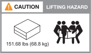

= Requisitos de instalação para sistemas de storage ASA R2
:allow-uri-read: 
:icons: font
:imagesdir: ../media/

[role="lead"]
Reveja o equipamento necessário e as precauções de elevação para o seu sistema de armazenamento ASA r2 e prateleiras de armazenamento.

== Equipamento necessário para instalação

Para instalar o sistema de storage ASA r2, você precisa dos seguintes equipamentos e ferramentas.

* Acesso a um navegador da Web para configurar o sistema de armazenamento
* Fita de descarga eletrostática (ESD)
* Lanterna
* Computador portátil ou console com conexão USB/serial
* Clipe de papel ou caneta esferográfica de ponta estreita para definir NS224 IDs de prateleira de armazenamento
* Chave de fendas Phillips nº 2

== Precauções de elevação

Os sistemas de storage da ASA r2 e NS224 compartimentos de storage são pesados. Tenha cuidado ao levantar e mover estes itens.

=== Pesos do sistema de armazenamento

Tome as precauções necessárias ao mover ou elevar o seu sistema de armazenamento ASA R2.

[role="tabbed-block"]
====
.ASA A1K
--
Um sistema de armazenamento ASA A1K pode pesar até 28,5 kg (62,83 lbs). Para levantar o sistema, utilize duas pessoas ou um elevador hidráulico.

image::../media/drw_a1k_weight_caution_ieops-1698.svg[Ícone de aviso de elevação do AFF A1K]

--
.ASA A70 e ASA A90
--
Um sistema de armazenamento ASA A70 ou um sistema de armazenamento ASA A90 podem pesar até 68,8 kg (151,68 lbs). Para levantar o sistema, utilize quatro pessoas ou um elevador hidráulico.

--
====

=== Peso da prateleira de armazenamento

Uma prateleira de armazenamento de NS224 kg pode pesar até 66,78 lbs (30,29 kg). Para levantar a prateleira de armazenamento, utilize duas pessoas ou um elevador hidráulico. Mantenha todos os componentes na prateleira de armazenamento (dianteira e traseira) para evitar o desbalanceamento do peso da prateleira.

image::../media/drw_ns224_lifting_weight_ieops-1716.svg[NS224 precaução de elevação]

.Informações relacionadas
* https://library.netapp.com/ecm/ecm_download_file/ECMP12475945["Informações de segurança e avisos regulamentares"^]

.O que se segue?
Depois de analisar os requisitos de hardware, você link:prepare-hardware.html["Prepare-se para instalar o sistema de storage ASA r2"].
